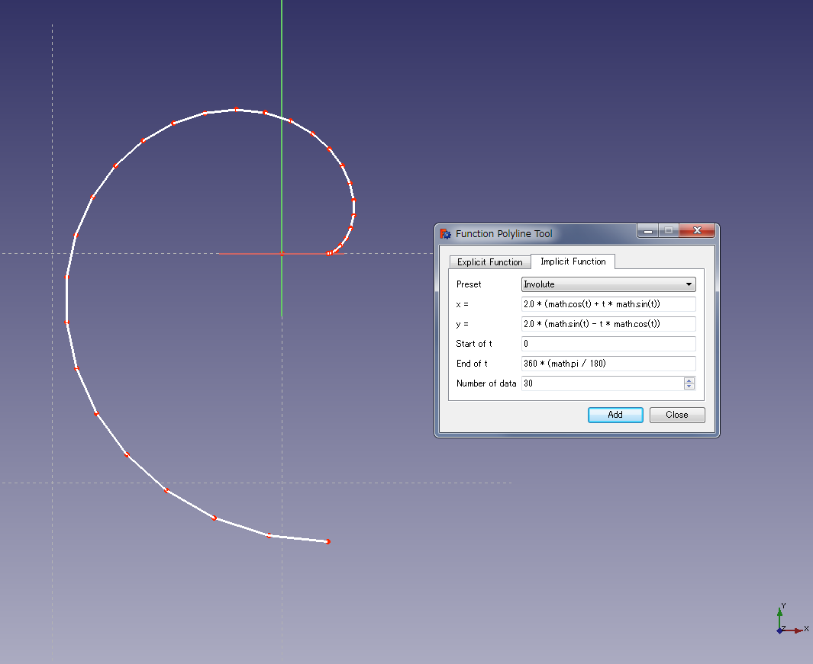
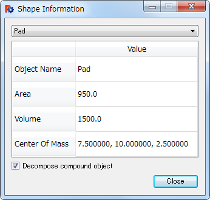

# ExTools for FreeCAD

### What is ExTools for FreeCAD?
ExTools for FreeCAD (**Ex**tension **tools for FreeCAD**) are unofficial plugins for [FreeCAD](URL https://github.com/FreeCAD).

#### Function Polyline Tool

You can draw a polyline according to a mathematical formula with this tool. The formula is defined by Python format math function.

#### Shape Information Tool

You can confirm surface area, volume and center of mass for selected object with this tool.

In your use, please read document/index.html of this project.

### License
ExTools for FreeCAD is licenced under LGPL version 2.1 / version 3.

### How to install?
***Windows*** - Click "install.js".

***Linux/Mac OS X*** - Run "install.py" on Python 2.7.x.
